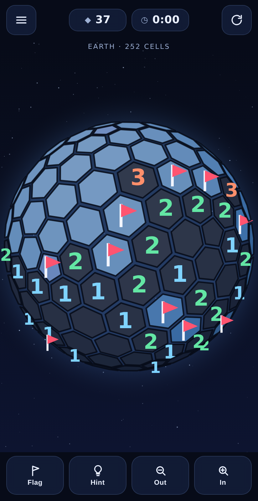

# Anna's Games

A small collection of self-contained web games. No build step, no dependencies,
no network — open the HTML and play.

## 🌐 [Globesweeper](globesweeper/) — minesweeper on a globe

A rebuild of a much-loved Android puzzle game that is no longer on the Play
Store: a sphere tiled with hexagons (and the twelve unavoidable pentagons), with
no edges and no corners to start from. Spin it with a finger and sweep it clean.

Every board is verified guess-free by a built-in solver before you see it, hints
explain their own reasoning, and it installs to an Android home screen and runs
fully offline.

[**Play →**](globesweeper/index.html) · [Read more →](globesweeper/README.md)



## 💬 [Signal & Static](index.html) — high-stakes English communication

A story-driven game for 16–18 year olds. Students practise interpreting
ambiguity under pressure, balancing tone and precision, responding to
misinformation, writing concise public statements, and reflecting on language
trade-offs.

[**Play →**](index.html)

## Tests

```sh
node tests/run.js
```

## Layout

```
index.html script.js styles.css   Signal & Static
globesweeper/                     Globesweeper (see its own README)
tests/run.js                      test suite
tools/make-icons.js               renders Globesweeper's app icons
```
